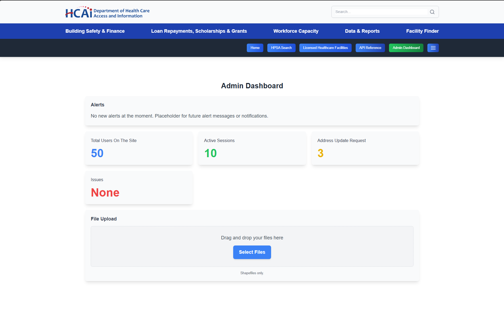
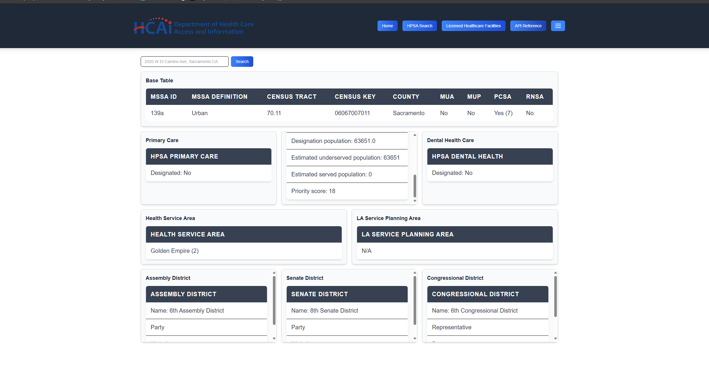

# HCAI GeoPortal


> **HCAI GeoPortal** is a full‑stack application that streamlines geospatial data management for California’s **Health Care Access & Information (HCAI)** programs.  Built with **React + TypeScript + Vite** on the front‑end and **Django Ninja** on the back‑end, it provides a single place to upload, validate, and visualize healthcare‑facility data while exposing a secure REST API for downstream tools.

---

## 1   Project Overview

HCAI oversees four key program areas—**Facilities, Workforce, Affordability, and Data**—each of which depends on accurate, up‑to‑date facility locations.  Historically, addresses were cleaned, geocoded, and corrected in separate spreadsheets, making it difficult to keep systems in sync.  **GeoPortal** was created to replace that manual process with an authenticated web interface, bulk‑upload workflow, and policy‑based API so that HCAI analysts can:

* Upload Excel workbooks of Cordinate Overrides
* Override incorrect coordinates, track the change history, and audit who did what
* Search by address in real‑time (Azure Maps) while honoring manual overrides
* Export clean datasets or call the API directly
* Manage API keys and view usage metrics

## 2  Why We Built It

* **Develop a user-friendly GIS platform** – provide easy access to healthcare data through GIS coordinates.
* **Single source of truth** – ensure every HCAI program area references the same, validated coordinates.
* **Security & auditing** – granular API keys, role‑based admin, and a full change log.
* **Scalability** – container‑ready deployment that fits on‑prem or cloud (Azure/Kubernetes/Docker Compose).


## 3   Screenshots

| | |
|---|---|
| **Admin Dashboard – Manual Overrides** | **Data Table – Bulk Upload Results** |
|  |  |

### Add more screenshots in !!! and reference them here as your UI evolves._

## 4   Features at a Glance

- **Excel Upload** – drag‑and‑drop `.xlsx` files, server‑side schema validation
- **Real‑time Geocoding** – Azure Maps lookup with fallback to manual entry
- **Coordinate Override CRUD** – full create/edit/delete with audit trail
- **API Key Management** – generate, revoke, and rotate keys in‑app
- **Dark‑Mode UI** – Discord‑inspired Tailwind theme with full accessibility
- **Comprehensive Test Suite** – Pytest + Django test client, Vitest + React Testing Library, and Selenium end‑to‑end tests

## 5   Getting Started

### 5.1  Prerequisites

| Tool | Version |
|------|---------|
| Python | 3.11+ |
| Node .js | 20 LTS |
| Docker | 24+ (optional but recommended) |
| Git | latest |

### 5.2  Clone & Setup

```bash
# Clone the repo
$ git clone https://github.com/your‑org/hcai‑geoportal.git
$ cd hcai‑geoportal

# Back‑end (Django)
$ python -m venv venv && source venv/bin/activate
$ pip install -r requirements.txt
$ cp Geo/.env.example Geo/.env  # fill in secrets (Azure Maps, DB, etc.)
$ python manage.py migrate
$ python manage.py createsuperuser  # optional

# Front‑end (React)
$ cd react-front-end-wip/Geo_app
$ npm install
$ npm run dev  # local dev server on http://localhost:5173
```

### 5.3  Docker Compose (one‑liner)

```bash
# From project root
$ docker compose up --build
```

The stack will start on `http://localhost:8000` (API) and `http://localhost:5173` (UI).

1. If needed you can apply migrations
   ```bash
   #Can be run by a docker or seperate terminal
   docker exec -it geo_django python manage.py migrate
   ```

## 6   Testing

| Layer | Command | Notes |
|-------|---------|-------|
| **Backend Unit & Integration** | `docker exec -it geo_django python manage.py test` or `python manage.py test` | Uses Django test database |
| **End‑to‑End / Frontend (Selenium)** | `py <testname>` Example: `py .\override_test.py` | Requires ChromeDriver in `PATH` (Provided in Repo)|

Test result screenshots are stored in `Geo/tests/**`.

## 7   Deployment

1. Set environment variables (Use `.env` provided).
2. Configure production database (Azure PostgreSQL, AWS RDS, etc.).
3. Build front‑end:
   ```bash
   cd react-front-end-wip/Geo_app
   npm run build
   ```
4. Collect static files and apply migrations:
   ```bash
   cd Geo/Geo/
   python manage.py migrate
   ```
5. Serve with Gunicorn/Uvicorn behind Nginx, or deploy the Docker image to your container platform.

## 8   Contributors

| Name |Contact |
|------|------|
| Michael Mehrdadi <span title="Project Lead">🛠️</span> | 		michaelmehrdadi123@gmail.com |
| Brandon Balinado <span title="Developer">🛠️</span>    | 		brandonjbalinado@gmail.com   |
| Prithisha Panta  <span title="Developer">🛠️</span>    | 		prithisha.panta22@gmail.com  |
| Yahir Ramos      <span title="Developer">🛠️</span>    | 		Yahirrp530@gmail.com         |
| Prashant Ram     <span title="Developer">🛠️</span>    | 		ramprashant66@gmail.com      |
| Ben Eklund       <span title="Developer">🛠️</span>    |     eklundbenjaminj@gmail.com    |
| <em>Add&nbsp;Name</em> | email@example.com |

### EVERYONE ADD UR NAME

## 9   License

This project is licensed under the **MIT License**.  See `LICENSE` for details.

---

<!-- Reminder: The CSC 190 timeline/future‑enhancement section was intentionally removed per course requirements. -->

